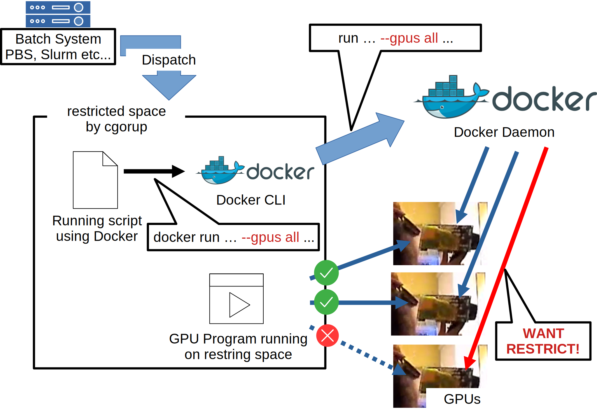
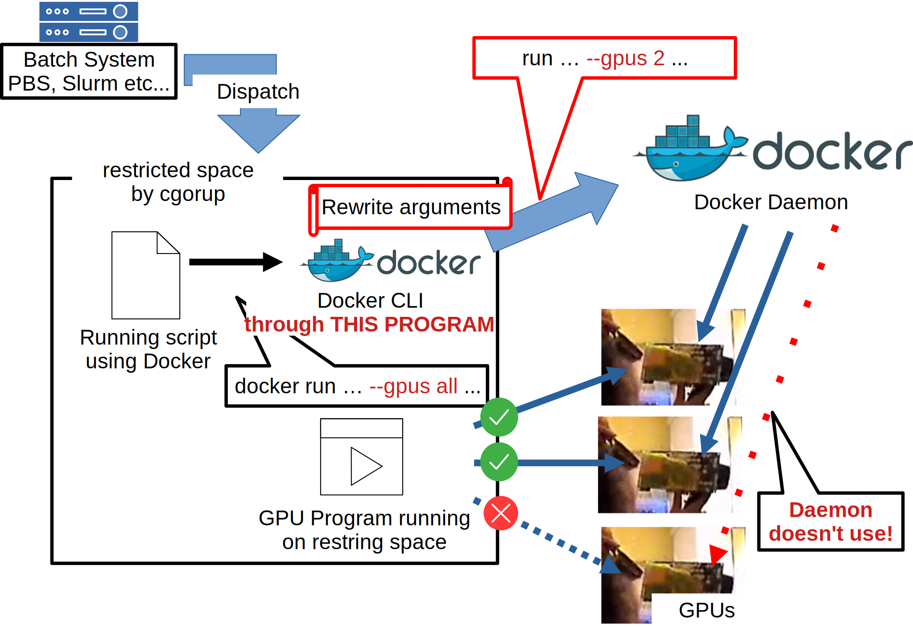

# gpudocker-inside-batchsys
Docker --gpu rewrite system for Batch System.  
This is to use docker with gpus inside batch system such as PBS, Slurm.  
They have own docker integration modules, but they are different from conventional ways.  
So, this will enable you to use docker inside batch system's script with correctly gpu resource managing.  
This works very simply, see the figure below.  
  

When you call docker cli inside batch script, docker cli communicate with docker daemon.  
If you choose `--gpus all`, docker cli doesn't resolve, and pass it to docker daemon.  
So docker daemon use all gpus which daemon can see.  
It is not good, because batch system restricts usable gpu counts by cgoroups.  
Docker CLI runs on the restricted space by cgroups, but daemon runs outside that space.  
So docker daemon can see more gpus than programs running on restricted space.  
It may occur confliction on using gpus.  

This program rewrites --gpus arguments.  
This sees count of gpus on restricted space, and rewrite argument,  
so even if user call docker with `--gpus all`, this program rewrite and communicate with docker daemon with fixing count of gpus.  
Then docker daemon use only limited gpus, so gpu conflictions are avoided.
